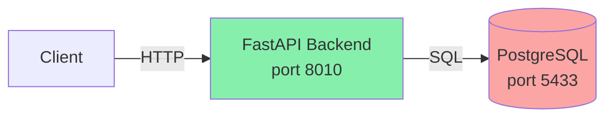

# URL Shortener MVP

A FastAPI-based URL shortener with JWT authentication, free tier limits, and click tracking.

## Quickstart

```powershell
# 1. Start services
docker compose up --build -d

# 2. Run migrations (first time only)
Get-Content docs/migrations/0001_users_limits.sql | docker compose exec -T db psql -U shortener_user -d shortener
Get-Content docs/migrations/0002_add_user_tracking.sql | docker compose exec -T db psql -U shortener_user -d shortener

# 3. Verify everything works
powershell -ExecutionPolicy Bypass -File .\verify.ps1
```

**Expected**: All 8 tests pass ✅

---

## API Endpoints

| Method | Endpoint | Auth | Description | Status Codes |
|--------|----------|------|-------------|--------------|
| `GET` | `/api/health` | ❌ | Health check | 200 |
| `POST` | `/api/auth/register` | ❌ | Create user account | 201, 400 |
| `POST` | `/api/auth/login-json` | ❌ | Login (JSON body) | 200, 401 |
| `POST` | `/api/auth/login` | ❌ | Login (form data) | 200, 401 |
| `GET` | `/api/me` | ✅ | Get current user info | 200, 401 |
| `POST` | `/api/urls` | ✅ | Create short URL | 201, 401, 403, 422 |
| `GET` | `/{short_code}` | ❌ | Redirect to long URL | 302, 404 |
| `GET` | `/api/urls/{short_code}/stats` | ❌ | Get click statistics | 200, 404 |

**Notes**:
- ✅ = Requires `Authorization: Bearer <token>` header
- Free tier: 3 active URLs per user
- Click limit: 1000 per URL (default)

---

## Request/Response Examples

### Register

**PowerShell**:
```powershell
$body = @{
    email = "demo@test.local"
    password = "SecurePass123!"
} | ConvertTo-Json

Invoke-RestMethod -Uri "http://localhost:8010/api/auth/register" `
    -Method POST -ContentType "application/json" -Body $body
```

**curl**:
```bash
curl -X POST "http://localhost:8010/api/auth/register" \
  -H "Content-Type: application/json" \
  -d '{"email":"demo@test.local","password":"SecurePass123!"}'
```

**Response** (201):
```json
{
  "id": 1,
  "email": "demo@test.local",
  "is_active": true,
  "plan": "free",
  "created_at": "2026-01-09T19:00:00"
}
```

---

### Login

**PowerShell**:
```powershell
$body = @{
    email = "demo@test.local"
    password = "SecurePass123!"
} | ConvertTo-Json

$auth = Invoke-RestMethod -Uri "http://localhost:8010/api/auth/login-json" `
    -Method POST -ContentType "application/json" -Body $body
$token = $auth.access_token
```

**curl**:
```bash
curl -X POST "http://localhost:8010/api/auth/login-json" \
  -H "Content-Type: application/json" \
  -d '{"email":"demo@test.local","password":"SecurePass123!"}' \
  | jq -r '.access_token'
```

**Response** (200):
```json
{
  "access_token": "eyJhbGciOiJIUzI1NiIsInR5cCI6IkpXVCJ9...",
  "token_type": "bearer"
}
```

---

### Create Short URL

**PowerShell**:
```powershell
$headers = @{ Authorization = "Bearer $token" }
$body = @{ long_url = "https://example.com" } | ConvertTo-Json

$url = Invoke-RestMethod -Uri "http://localhost:8010/api/urls" `
    -Method POST -Headers $headers -ContentType "application/json" -Body $body
$shortCode = $url.short_code
```

**curl**:
```bash
curl -X POST "http://localhost:8010/api/urls" \
  -H "Authorization: Bearer $token" \
  -H "Content-Type: application/json" \
  -d '{"long_url":"https://example.com"}'
```

**Response** (201):
```json
{
  "id": 1,
  "short_code": "a",
  "long_url": "https://example.com",
  "created_at": "2026-01-09T19:00:00",
  "expires_at": null,
  "is_active": true
}
```

**Error** (403 - 4th URL on free tier):
```json
{
  "detail": "Free plan limit reached (max 3 active URLs)"
}
```

---

### Redirect

**PowerShell**:
```powershell
# Using HttpClient to avoid auto-redirect
Add-Type -AssemblyName System.Net.Http
$handler = New-Object System.Net.Http.HttpClientHandler
$handler.AllowAutoRedirect = $false
$client = New-Object System.Net.Http.HttpClient($handler)

$response = $client.GetAsync("http://localhost:8010/$shortCode").Result
[int]$response.StatusCode  # 302
$response.Headers.GetValues("Location") | Select-Object -First 1  # https://example.com
```

**curl**:
```bash
curl -I "http://localhost:8010/$shortCode"
# HTTP/1.1 302 Found
# Location: https://example.com
```

---

### Stats

**PowerShell**:
```powershell
$stats = Invoke-RestMethod -Uri "http://localhost:8010/api/urls/$shortCode/stats"
$stats.total_clicks  # 1
```

**curl**:
```bash
curl "http://localhost:8010/api/urls/$shortCode/stats"
```

**Response** (200):
```json
{
  "url": {
    "id": 1,
    "short_code": "a",
    "long_url": "https://example.com",
    "created_at": "2026-01-09T19:00:00",
    "expires_at": null,
    "is_active": true
  },
  "total_clicks": 1,
  "by_date": [
    {"date": "2026-01-09", "clicks": 1}
  ]
}
```

---

## Architecture



**Components**:
- **FastAPI** (Python 3.11): API + JWT auth + business logic
- **PostgreSQL** (16-alpine): User accounts, URLs, click tracking
- **Nginx** (optional): Proxy with rate limiting (tests hit backend directly)

**Data Flow**:
1. User registers → JWT token issued
2. User creates URL → `short_code` generated (base62 of ID)
3. Visitor accesses `/{short_code}` → 302 redirect + click logged
4. User checks `/api/urls/{short_code}/stats` → aggregated analytics

---

## MVP Decisions

### Why No Redis/Workers/Background Jobs?

MVP simplicity. Click tracking uses:
- **Atomic SQL**: `UPDATE urls SET click_count = click_count + 1 WHERE ...` (race-safe)
- **Direct inserts**: Click details saved synchronously in `clicks` table

Trade-off: Slight latency on redirects (~10ms) for write consistency. Acceptable for MVP scale.

---

### Why `user_email` Instead of Foreign Key?

The `urls.user_email` column stores email as VARCHAR (no FK constraint to `users.id`).

**Rationale**:
- JWT `sub` claim already contains email → no extra lookup
- Simplifies free tier query: `SELECT COUNT(*) WHERE user_email = ? AND is_active = TRUE`
- Allows orphaned URLs if user deleted (soft relationship)

Trade-off: Denormalization. Future can migrate to `user_id` FK if needed.

---

### Why PowerShell verify.ps1?

Windows-friendly E2E testing without external tools (pytest, newman).

**Covers**:
1. ✅ Docker compose orchestration
2. ✅ Health checks + retries
3. ✅ Full auth flow (register → login → JWT)
4. ✅ Free tier enforcement (3 URL limit)
5. ✅ Redirect validation (302 + Location header)
6. ✅ Click tracking + stats

Alternative: `curl` scripts work but require manual parsing. PowerShell provides structured JSON handling out-of-the-box.

---

## Database Migrations

**Required setup** (first time only):

```powershell
# Migration 1: Users + basic limits
Get-Content docs/migrations/0001_users_limits.sql | `
  docker compose exec -T db psql -U shortener_user -d shortener

# Migration 2: User email tracking (CRITICAL)
Get-Content docs/migrations/0002_add_user_tracking.sql | `
  docker compose exec -T db psql -U shortener_user -d shortener
```

**Verify schema**:
```powershell
docker compose exec -T db psql -U shortener_user -d shortener -c "\d+ urls"
# Confirm: user_email, click_count, click_limit columns exist
```

---

## Rate Limiting (Nginx)

Configured in `nginx/nginx.conf`:

| Endpoint | Limit | Burst |
|----------|-------|-------|
| `POST /api/urls` | 1 req/sec | 3 |
| All others | 10 req/sec | 20 |

**Response when exceeded**: HTTP 503

**Note**: `verify.ps1` hits backend directly (port 8010) to bypass Nginx for testing.

---

## Testing

See full testing documentation: [docs/testing.md](docs/testing.md)

**Automated tests**:
```powershell
powershell -ExecutionPolicy Bypass -File .\verify.ps1
```

**Manual API examples**: [docs/api.md](docs/api.md)

---

## Project Structure

```
repo/
├── backend/
│   ├── app/
│   │   ├── routers/          # API endpoints
│   │   ├── services/         # Business logic
│   │   ├── models.py         # SQLAlchemy ORM
│   │   ├── schemas.py        # Pydantic validation
│   │   └── main.py           # FastAPI app
│   ├── Dockerfile
│   └── requirements.txt
├── nginx/
│   └── nginx.conf            # Reverse proxy + rate limits
├── docs/
│   ├── migrations/           # SQL migration scripts
│   ├── testing.md            # Test documentation
│   └── api.md                # API examples
├── docker-compose.yml
├── verify.ps1                # Automated E2E tests
└── README.md
```

---

## Environment Variables

Defined in `.env`:

```bash
# Database
DB_NAME=shortener
DB_USER=shortener_user
DB_PASSWORD=shortener_pass_123

# Security
SECRET_KEY=super_secret_key_for_dev_only  # CHANGE IN PRODUCTION
ACCESS_TOKEN_EXPIRE_MINUTES=30
```

---

## API Documentation

- **Swagger UI**: http://localhost:8010/docs
- **ReDoc**: http://localhost:8010/redoc
