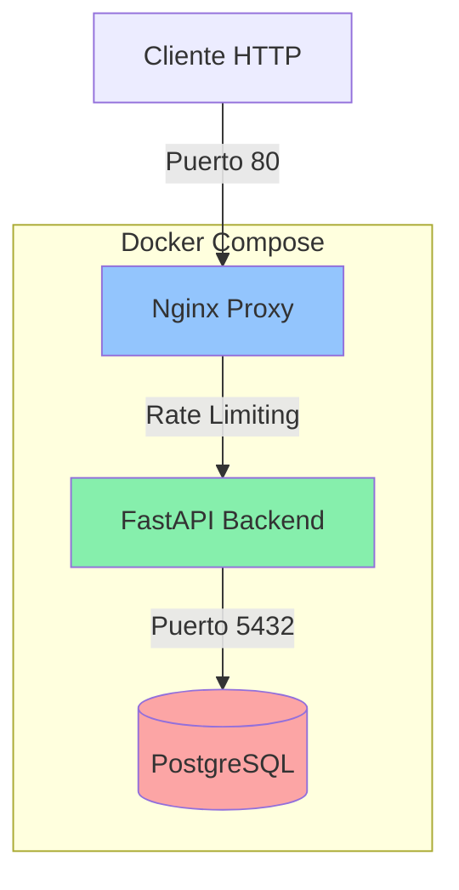
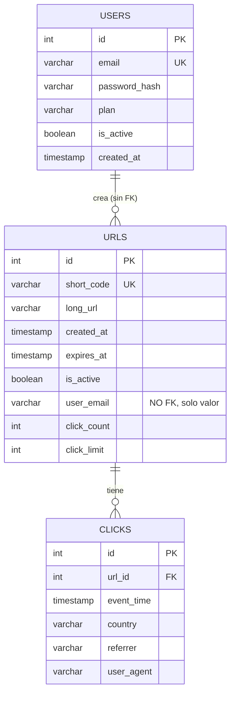
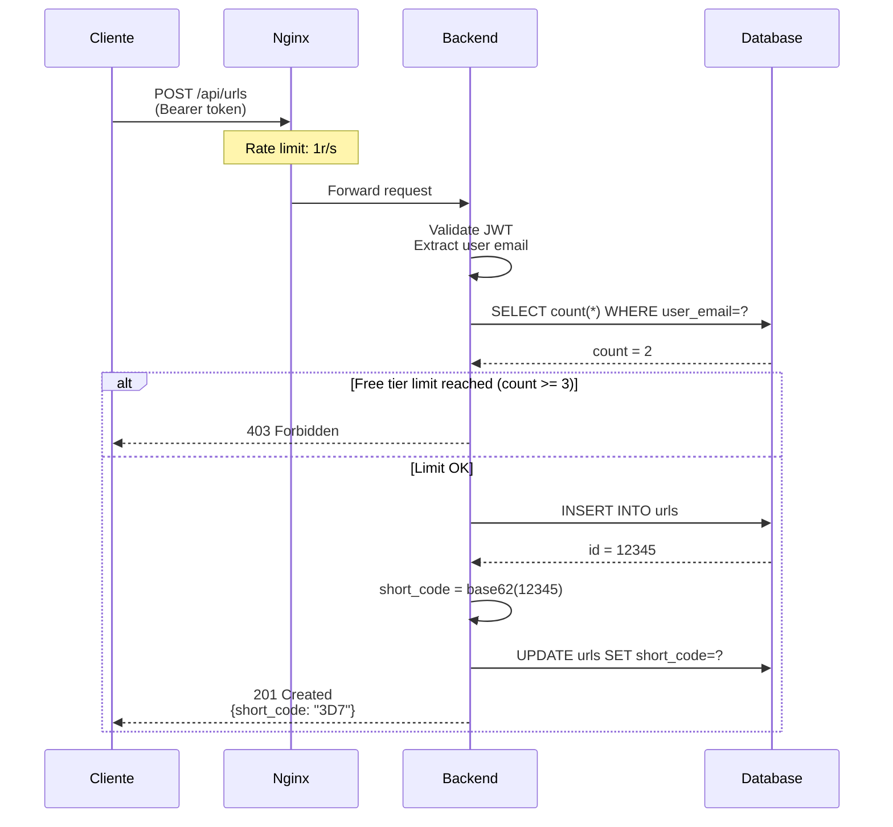
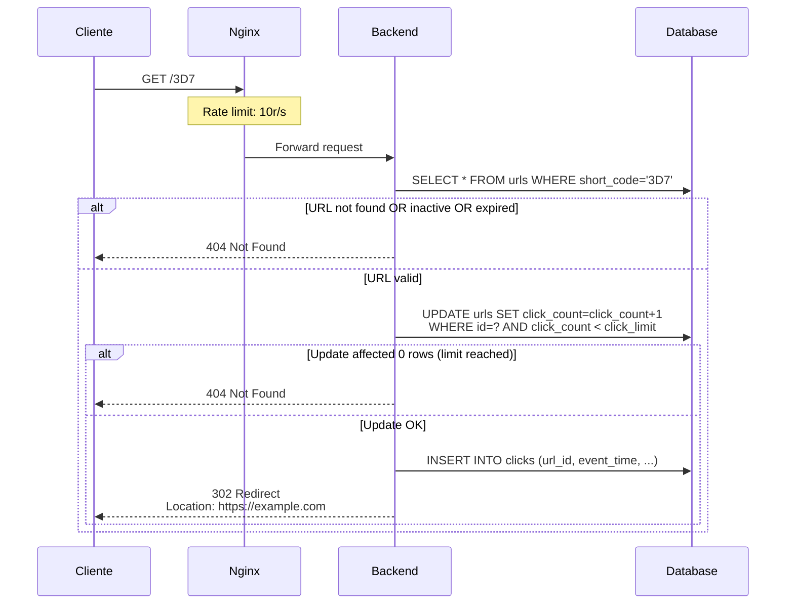

# URL Shortener Project - Análisis Completo

**Fecha**: 2026-01-09  
**Versión**: MVP 0.1.0

---

## 📋 Resumen Ejecutivo

Este proyecto es un **acortador de URLs** construido con FastAPI como backend y PostgreSQL como base de datos. La arquitectura sigue un patrón modular con separación clara entre routers (endpoints), services (lógica de negocio) y models (ORM). El proyecto está completamente dockerizado y utiliza Nginx como proxy reverso con rate limiting.

**No hay frontend** - es una API REST pura con documentación automática vía FastAPI/Swagger.

---

## 🏗️ Arquitectura General



### Servicios Docker

El sistema está compuesto por **3 servicios** principales:

1. **proxy** (Nginx)
   - Imagen: `nginx:1.25-alpine`
   - Puerto expuesto: `80:80`
   - Función: Proxy reverso + Rate limiting
   
2. **backend** (FastAPI)
   - Build: Custom Dockerfile
   - Puerto expuesto: `8010:8000`
   - Función: API REST + Lógica de negocio
   - Depende de: `db` (healthcheck)
   
3. **db** (PostgreSQL)
   - Imagen: `postgres:16-alpine`
   - Puerto expuesto: `5433:5432`
   - Función: Base de datos persistente
   - Volumen: `postgres-data`

---

## 🔐 Seguridad y Autenticación

### JWT (JSON Web Tokens)

- **Algoritmo**: HS256
- **Expiración**: 30 minutos (configurable vía env)
- **Payload incluye**:
  - `sub`: email del usuario
  - `uid`: user ID
  - `plan`: plan del usuario (free/premium)

### Hashing de Contraseñas

- **Esquemas**: Argon2 (preferido) + Bcrypt (fallback)
- **Librería**: `passlib` con `CryptContext`
- **No hay validación de fortaleza** de contraseña en el código actual

---

## 📊 Modelo de Datos



### Relaciones Clave

> [!IMPORTANT]
> **User ↔ URL**: La relación NO usa foreign key tradicional. En su lugar, `urls.user_email` almacena el email del usuario como VARCHAR.
> 
> **Razones de este diseño**:
> - Simplifica queries de free tier (no necesita JOIN)
> - El JWT ya contiene el email (`sub` claim)
> - Permite URLs huérfanas si se elimina un usuario
> - **Trade-off**: Desnormalización aceptable para MVP

**Click ↔ URL**: Relación 1:N con FK constraint (`ON DELETE CASCADE`)

---

## 🔗 Endpoints (API REST)

### Health Check

| Método | Endpoint | Auth | Descripción |
|--------|----------|------|-------------|
| `GET` | `/api/health` | ❌ No | Health check básico |

**Respuesta**:
```json
{"status": "ok"}
```

---

### Autenticación (`/api/auth`)

| Método | Endpoint | Auth | Descripción |
|--------|----------|------|-------------|
| `POST` | `/api/auth/register` | ❌ No | Registro de usuario |
| `POST` | `/api/auth/login` | ❌ No | Login (OAuth2 form data) |
| `POST` | `/api/auth/login-json` | ❌ No | Login (JSON body) |
| `GET` | `/api/me` | ✅ Sí | Info del usuario actual |

**Registro - Request**:
```json
{
  "email": "user@example.com",
  "password": "secret"
}
```

**Login - Request** (OAuth2 form):
```
username=user@example.com
password=secret
```

**Login JSON - Request**:
```json
{
  "email": "user@example.com",
  "password": "secret"
}
```

**Login - Response**:
```json
{
  "access_token": "eyJ...",
  "token_type": "bearer"
}
```

---

### URLs (`/api/urls`)

| Método | Endpoint | Auth | Descripción |
|--------|----------|------|-------------|
| `POST` | `/api/urls` | ✅ Sí | Crear URL acortada |
| `GET` | `/api/urls/{short_code}/stats` | ❌ No* | Estadísticas de URL |

*Stats no requiere auth actualmente, pero debería (comentado en README)

**Crear URL - Request**:
```json
{
  "long_url": "https://example.com",
  "expires_at": "2026-12-31T23:59:59"  // opcional
}
```

**Crear URL - Response**:
```json
{
  "id": 123,
  "short_code": "a1b2c3",
  "long_url": "https://example.com",
  "created_at": "2026-01-09T12:00:00",
  "expires_at": null,
  "is_active": true
}
```

**Stats - Response**:
```json
{
  "url": { /* URLInfo object */ },
  "total_clicks": 42,
  "by_date": [
    {"date": "2026-01-09", "clicks": 15},
    {"date": "2026-01-08", "clicks": 27}
  ]
}
```

---

### Redirección

| Método | Endpoint | Auth | Descripción |
|--------|----------|------|-------------|
| `GET` | `/{short_code}` | ❌ No | Redirige a URL larga |

**Respuesta**: HTTP 302 redirect

**Condiciones para redireccionar**:
1. ✅ URL existe
2. ✅ `is_active = true`
3. ✅ No expirada (`expires_at > now` o `null`)
4. ✅ Click count < click limit

**Criterio de Errores**: Si falla **CUALQUIERA** de las condiciones anteriores (URL no existe, inactiva, expirada o límite alcanzado), la API responde invariablemente con **HTTP 404 Not Found**. No se diferencia entre "no existe" y "límite alcanzado" (no hay 410 ni 403 en este endpoint).

---

## 🔧 Lógica de Negocio (Services)

### `url_service.py`

**Responsabilidad**: Crear URLs acortadas

**Flujo**:
1. Verificar límite de free tier (3 URLs por usuario)
2. Generar `short_code` usando base62 del ID
3. Insertar en DB
4. Retornar URL creada

**Free Tier Logic**:
```python
# Cuenta URLs activas del usuario
count = await session.execute(
    select(func.count(URL.id))
    .where(URL.user_email == user.email)
    .where(URL.is_active == True)
)
if count >= 3:
    raise HTTPException(403, "Free tier limit: 3 URLs")
```

---

### `redirect_service.py`

**Responsabilidad**: Redireccionar y trackear clicks

**Flujo**:
1. Buscar URL por `short_code`
2. Validar condiciones (activa, no expirada, bajo límite)
3. **UPDATE ATÓMICO** del click_count:
   ```sql
   UPDATE urls SET click_count = click_count + 1
   WHERE id = ? AND click_count < click_limit
   ```
4. Insertar registro en tabla `clicks`
5. Retornar `long_url`

> [!WARNING]
> **Race Condition Protection**: El UPDATE condicional evita que múltiples requests simultáneos superen el `click_limit`

---

### `stats_service.py`

**Responsabilidad**: Agregar estadísticas de clicks

**Flujo**:
1. Buscar URL por `short_code`
2. Contar clicks totales
3. Agrupar clicks por fecha (usando `func.date()`)
4. Retornar agregados

---

## 🚦 Rate Limiting (Nginx)

```nginx
# Zona de creación de URLs: 1 request/segundo, burst 3
limit_req_zone $binary_remote_addr zone=creation_limit:10m rate=1r/s;

# Zona de redirects: 10 requests/segundo, burst 20
limit_req_zone $binary_remote_addr zone=redirect_limit:10m rate=10r/s;
```

**Aplicación**:

| Endpoint | Límite | Burst | Zona |
|----------|--------|-------|------|
| `POST /api/urls` | 1 r/s | 3 | `creation_limit` |
| Todo lo demás | 10 r/s | 20 | `redirect_limit` |

**Respuesta cuando se excede**: HTTP 503 (Service Unavailable)

> [!NOTE]
> **Acceso Local**:
> - `localhost:8010`: Conecta directo a FastAPI (SALTA Nginx y Rate Limits).
> - `localhost` (puerto 80): Pasa por Nginx (APLICA Rate Limits).

---

## 💾 Migraciones de Base de Datos

### `0001_users_limits.sql`

**Propósito**: Setup inicial de usuarios y límites

**Contradicción (Tech Debt)**:
- Esta migración crea `user_id` INTEGER y una Foreign Key `fk_urls_users`.
- Sin embargo, el **código actual del backend NO usa esta columna ni la FK**.
- El código depende exclusivamente de `user_email` (ver migración 0002).

---

### `0002_add_user_tracking.sql` ⭐

**Propósito**: Agregar tracking de usuarios POR EMAIL

**Nota Crítica**:
- Agrega `user_email` VARCHAR (nullable) que es la columna **realmente usada** por la aplicación para asociar usuarios.
- **Riesgo**: Si no se corre esta migración, la aplicación fallará al intentar leer/escribir `user_email`.

**Estado Actual**:
Se requiere ejecutar ambas migraciones para que la DB esté en el estado esperado por `verify.ps1`, aunque `user_id` quede como columna huérfana.

**Inconsistencia Detectada (Tech Debt)**:
Existe una discrepancia entre la migración 0001 (que intenta usar `user_id` con FK) y la realidad del backend (que usa `user_email`).

- **Riesgo**: La migración 0002 es la que habilita el campo `user_email`. Sin ella, el backend falla.
- **Estado**: Aunque lo ideal es limpiar el schema, actualmente el sistema "funciona" arrastrando la columna `user_id` vacía. Validar estado de la DB antes de desplegar.

---

## 🔍 Schema Actual vs ORM

### Estado Actual del Schema

Basado en `docs/db-schema-snapshot.md`, la tabla `urls` tiene columnas redundantes:

| Columna | Tipo | Uso en App | Nota |
|---------|------|------------|------|
| `user_email` | VARCHAR | ✅ SI | Logical Key usada por `url_service.py` |
| `user_id` | INTEGER | ❌ NO | Creada por migración 0001, ignorada por ORM |
| `click_count` | INTEGER | ✅ SI | Usada para límites |
| `click_limit` | INTEGER | ✅ SI | Usada para límites |

### Modelo ORM (`models.py`)

- **Dependencia Crítica**: El backend depende TOTALMENTE de `urls.user_email`. Si esta columna falta en la DB, la aplicación **fallará** (Error 500) al intentar operaciones con URLs.
- El modelo **NO** define `user_id`, por lo que esa columna es invisible para la aplicación.

> [!NOTE]
> **Diseño intencional**: El comment en línea 20 de `models.py` dice:
> ```python
> # No ORM relationship to URLs - using explicit queries with user_email
> ```

---

## 🛠️ Utilidades

### `utils.py` - Base62 Encoding

**Propósito**: Convertir IDs numéricos a códigos cortos alfanuméricos

**Alfabeto**: `0-9A-Za-z` (62 caracteres)

**Ejemplo**:
```python
encode_base62(12345)  # → "3D7"
encode_base62(999999) # → "4C91"
```

**Uso**: Generación de `short_code` a partir del ID de la URL

---

## 🧪 Testing

### Verificación Automatizada

El proyecto incluye `verify.ps1` (PowerShell script) que ejecuta **8 tests E2E**:

1. ✅ Docker compose up
2. ✅ Backend health check
3. ✅ User registration
4. ✅ User login (JWT)
5. ✅ Create 3 URLs (free tier)
6. ✅ 4th URL blocked (403 - free tier limit)
7. ✅ Redirect (302) con protección contra loops
8. ✅ Stats endpoint

**Ejecución**:
```powershell
powershell -ExecutionPolicy Bypass -File .\verify.ps1
```

### Testing Manual

Documentación completa en [`docs/testing.md`](file:///c:/Users/sysadmin/Documents/docker-projects/url_shortener_project/repo/docs/testing.md)

---

## 📦 Dependencias (Backend)

```txt
fastapi[standard]    # Framework web + Uvicorn
asyncpg              # PostgreSQL async driver
sqlalchemy[asyncio]  # ORM async
python-multipart     # Form data parsing
python-jose[cryptography]  # JWT
passlib[argon2]      # Password hashing
```

**Python version**: 3.11 (slim)

---

## ⚙️ Variables de Entorno

Definidas en [`.env`](file:///c:/Users/sysadmin/Documents/docker-projects/url_shortener_project/repo/.env):

```bash
# Database
DB_NAME=shortener
DB_USER=shortener_user
DB_PASSWORD=shortener_pass_123

# Security
SECRET_KEY=super_secret_key_for_dev_only
ACCESS_TOKEN_EXPIRE_MINUTES=30
```

> [!WARNING]
> **Producción**: Cambiar `SECRET_KEY` por uno aleatorio fuerte

---

## 🚀 Deployment

### Desarrollo Local

```bash
# 1. Levantar servicios
docker compose up --build

# 2. Aplicar migraciones (primera vez)
Get-Content docs/migrations/0001_users_limits.sql | `
  docker compose exec -T db psql -U shortener_user -d shortener
  
Get-Content docs/migrations/0002_add_user_tracking.sql | `
  docker compose exec -T db psql -U shortener_user -d shortener

# 3. Verificar
powershell -ExecutionPolicy Bypass -File .\verify.ps1
```

### Acceso a Servicios

- **API Docs**: http://localhost:8010/docs (Swagger UI)
- **Redoc**: http://localhost:8010/redoc
- **Backend directo**: http://localhost:8010
- **Nginx proxy**: http://localhost
- **PostgreSQL**: localhost:5433

---

## 🔄 Flujo de Creación de URL



---

## 🔄 Flujo de Redirección



---

## 📐 Diseño de Código

### Patrón de Capas

```
main.py
  ↓ include_router()
routers/
  ↓ Depends(get_current_user)
services/
  ↓ Business logic
models.py + schemas.py
  ↓ ORM + Validation
database.py
  ↓ AsyncSession
PostgreSQL
```

### Separación de Responsabilidades

| Capa | Responsabilidad | Ejemplo |
|------|----------------|---------|
| **Router** | Routing + Auth + Validación básica | `auth.py`, `urls.py` |
| **Service** | Lógica de negocio + Queries complejas | `url_service.py` |
| **Model** | ORM mapping + Relaciones | `models.py` |
| **Schema** | Validación de entrada/salida | `schemas.py` |
| **Core** | Config + Security utils | `config.py`, `security.py` |

---

## 🎯 Características Principales

### ✅ Implementadas

- ✅ Autenticación JWT con email/password
- ✅ Registro de usuarios
- ✅ Creación de URLs acortadas (con base62)
- ✅ Redirección con tracking de clicks
- ✅ Límite de free tier (3 URLs por usuario)
- ✅ Click limits por URL (default 1000)
- ✅ Expiración de URLs (opcional)
- ✅ Estadísticas agregadas por fecha
- ✅ Rate limiting (Nginx)
- ✅ Healthcheck de PostgreSQL
- ✅ Tests E2E automatizados

### ⚠️ Limitaciones / Tech Debt

- ⚠️ **No hay planes premium** implementados (solo flag `plan`)
- ⚠️ **Stats endpoint no requiere auth** (comentado como pendiente)
- ⚠️ **Migración 0001 crea `user_id` pero no se usa** (inconsistencia)
- ⚠️ **No hay validación de fortaleza de contraseña**
- ⚠️ **No hay soft delete** de URLs (solo flag `is_active`)
- ⚠️ **No hay paginación** en estadísticas
- ⚠️ **Short codes no son custom** (solo base62 del ID)
- ⚠️ **No hay analytics avanzadas** (geolocalización, devices, etc.)

### 🚧 Potenciales Mejoras

1. **Seguridad**:
   - Agregar protección auth al endpoint de stats
   - Validación de fortaleza de contraseñas
   - CORS configuration
   
2. **Features**:
   - Custom short codes (vanity URLs)
   - QR code generation
   - Bulk URL creation
   - URL editing/update
   - Gestión de planes premium
   
3. **Observability**:
   - Logging estructurado (JSON)
   - Tracing distribuido
   - Métricas con Prometheus
   
4. **Performance**:
   - Cache de redirects (Redis)
   - Connection pooling tuning
   - Índices adicionales

---

## 📝 Documentación Adicional

- [`README.md`](file:///c:/Users/sysadmin/Documents/docker-projects/url_shortener_project/repo/README.md): Setup y quick start
- [`docs/testing.md`](file:///c:/Users/sysadmin/Documents/docker-projects/url_shortener_project/repo/docs/testing.md): Guía de testing manual
- [`docs/db-schema-snapshot.md`](file:///c:/Users/sysadmin/Documents/docker-projects/url_shortener_project/repo/docs/db-schema-snapshot.md): Schema de base de datos
- [`docs/db-mismatch.md`](file:///c:/Users/sysadmin/Documents/docker-projects/url_shortener_project/repo/docs/db-mismatch.md): Análisis de inconsistencias (probablemente legacy)

---

## 🎓 Decisiones de Diseño Clave

### 1. Email como Logical FK (no Foreign Key)

**Decisión**: `urls.user_email` almacena el email directamente sin FK constraint

**Pros**:
- ✅ No necesita JOIN para queries de free tier
- ✅ JWT ya contiene email (`sub`)
- ✅ Simplifica lógica de servicios
- ✅ URLs pueden existir sin usuario (soft orphan)

**Cons**:
- ❌ Desnormalización (email duplicado)
- ❌ Sin integridad referencial
- ❌ Actualización de email complica sincronización

### 2. Click Tracking Atómico

**Decisión**: UPDATE condicional para incrementar click_count

```sql
UPDATE urls 
SET click_count = click_count + 1 
WHERE id = ? AND click_count < click_limit
```

**Beneficio**: Evita race conditions sin necesidad de locks explícitos

### 3. Base62 para Short Codes

**Decisión**: Generar códigos a partir del ID numérico

**Pros**:
- ✅ Único por diseño (basado en PK)
- ✅ Corto y legible
- ✅ Sin colisiones

**Cons**:
- ❌ Predecible (secuencial)
- ❌ No permite custom aliases

### 4. Nginx como Rate Limiter

**Decisión**: Rate limiting en capa de proxy (no en código)

**Beneficio**: 
- ✅ Protección antes de llegar al backend
- ✅ Menos carga en Python/DB
- ✅ Configuración centralizada

---

## 🔐 Consideraciones de Seguridad

### Implementadas

- ✅ Password hashing con Argon2
- ✅ JWT con expiración
- ✅ Rate limiting
- ✅ SQL injection protection (ORM)
- ✅ No expone stack traces (FastAPI default)

### Pendientes/Recomendaciones

- 🔴 **CRÍTICO**: Cambiar `SECRET_KEY` en producción
- 🟡 Agregar CORS configuration
- 🟡 HTTPS enforcement (en proxy)
- 🟡 Refresh tokens (JWT de 30 min es corto)
- 🟡 Account lockout tras intentos fallidos
- 🟡 Email verification en registro
- 🟡 Audit logging de acciones sensibles

---

## 📊 Volumetría y Escalabilidad

### Límites Actuales

| Recurso | Límite | Notas |
|---------|--------|-------|
| Free tier URLs | 3 por usuario | Hardcoded en `url_service.py` |
| Click limit | 1000 por URL | Default, configurable por URL |
| Rate limit creación | 1 r/s | Nginx config |
| Rate limit redirects | 10 r/s | Nginx config |

### Bottlenecks Potenciales

1. **DB Connections**: Sin pooling explícito
2. **Click tracking**: INSERT síncrono (podría ser async)
3. **Stats queries**: Sin cache, puede ser lento con muchos clicks

---

## 🗂️ Estructura de Archivos

```
repo/
├── backend/
│   ├── Dockerfile
│   ├── requirements.txt
│   └── app/
│       ├── __init__.py
│       ├── main.py              # Entry point
│       ├── database.py          # DB connection
│       ├── models.py            # ORM models
│       ├── schemas.py           # Pydantic schemas
│       ├── utils.py             # Base62 encoding
│       ├── core/
│       │   ├── config.py        # Env vars
│       │   └── security.py      # JWT + hashing
│       ├── routers/
│       │   ├── auth.py          # /api/auth/*
│       │   ├── urls.py          # /api/urls/*
│       │   ├── redirect.py      # /{short_code}
│       │   └── health.py        # /api/health
│       └── services/
│           ├── url_service.py
│           ├── redirect_service.py
│           └── stats_service.py
├── nginx/
│   └── nginx.conf               # Proxy + rate limit
├── docs/
│   ├── migrations/
│   │   ├── 0001_users_limits.sql
│   │   └── 0002_add_user_tracking.sql
│   ├── db-schema-snapshot.md
│   ├── db-mismatch.md
│   └── testing.md
├── docker-compose.yml
├── .env
├── .env.example
├── verify.ps1                   # E2E tests
└── README.md
```

---

## ✅ Resumen de Análisis

### Proyecto Sólido

Este es un **MVP bien estructurado** de un acortador de URLs que:

- ✅ Sigue **buenas prácticas** de separación de capas
- ✅ Usa **tecnologías modernas** (FastAPI, async, Docker)
- ✅ Tiene **tests automatizados** E2E
- ✅ Documenta **migraciones** y schema
- ✅ Implementa **seguridad básica** (JWT, hashing, rate limit)

### Áreas de Mejora

- ⚠️ **Inconsistencia** entre migración 0001 (`user_id`) y código (`user_email`)
- ⚠️ Falta **protección auth** en endpoint de stats
- ⚠️ Falta **frontend** (es solo API)
- ⚠️ **Rate limits** muy agresivos para producción (1 r/s creación)

### Listo para

- ✅ **Desarrollo local**
- ✅ **Demos/PoC**
- ✅ **Testing interno**

### Requiere trabajo antes de producción

- 🔴 Cambiar SECRET_KEY
- 🔴 Configurar HTTPS
- 🔴 Tunear rate limits
- 🔴 Agregar monitoring/logging
- 🔴 Resolver inconsistencia de migraciones
